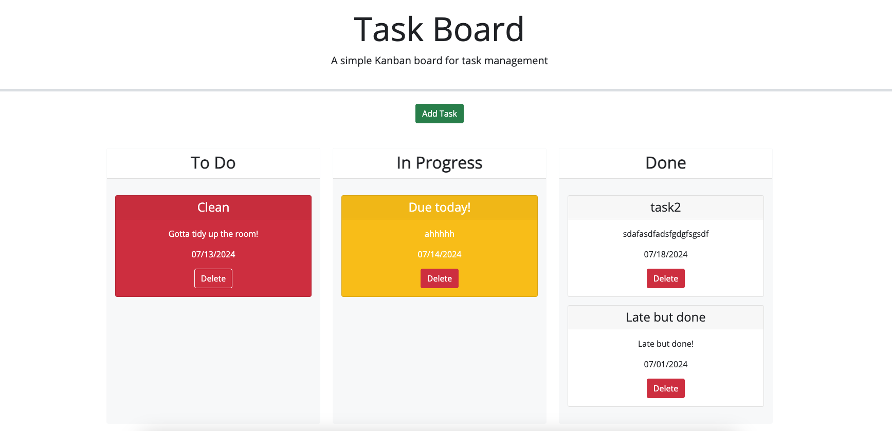

# Module 5 Challenge: Third-Party APIs - Task Board

This Homework assignment was completed for Unit Five of the U of M Bootcamp, to practice javascript third-party APIs, building out a dashboard to create, view, and sort drag-and-drop task tiles. The complete code allows a user to input tasks with due dates, which are color coded white if not due yet, red if overdue, or yellow if due today.

The date is assigned with a DayJS datepicker to track; if a task is moved to the done column it will turn white. Tiles can also be deleted with their own delete buttons or viewed later, thanks to localStorage.

## Link to Deployed Version
[Click here to view the deployed webpage.](https://floatingpoint-exaflop.github.io/task-board)

## Screenshot of Deployed Version

## Credits

Some starter code used and modified with permission for instructional purposes from U of M Bootcamp, Copyright 2024 edX.

Thanks to Eric Meyer for the [start.css](http://meyerweb.com/eric/tools/css/reset/) code.

Shoutout to [this blog post](https://www.seoptimer.com/blog/favicon-not-showing-up/) and [this tool](https://favicon.io/favicon-converter/) for the help with my favicon stuff.

I used [Day.js](https://day.js.org/en/) for my date picker in the modal.

## License

Please refer to the LICENSE in the repo.